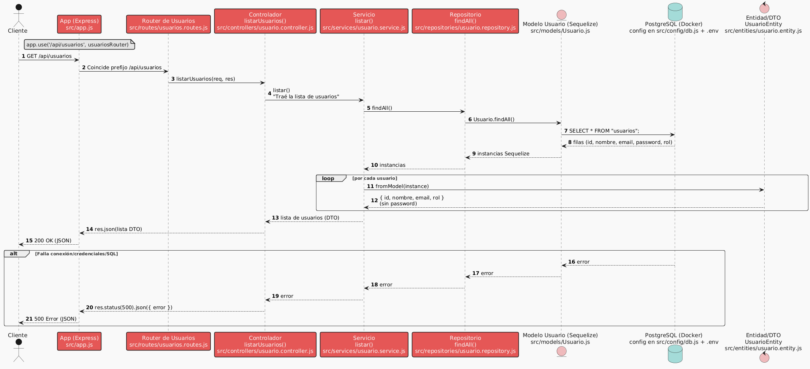

# � Sysacad

### Sistema de Gestión Académica Universitaria

👨�💻 **Desarrollado por:**

- Branko Almeira
- Federico Sosa
- Agustin Giorlando

�� **Carrera:** Ingeniería en Sistemas de Información

🎓 UTN – Facultad Regional San Rafael (FRSR)

📆 **Materia:** Desarrollo de Software — 2025

---

## 📖 1. Introducción

### 1.1 Visión general del proyecto

El sistema **Sysacad** es una aplicación web orientada a la gestión académica universitaria. Permite administrar usuarios, materias, inscripciones y calificaciones, adaptándose a los diferentes roles: **alumno**, **profesor** y **administrador, etc**.

A partir de esta versión, Sysacad adopta una **arquitectura orientada a objetos**, donde cada entidad (como `Usuario`, `Materia`, `Inscripcion`, etc.) está representada por una clase definida con Sequelize como ORM. Esta estructura facilita el mantenimiento, escalabilidad y testeo del sistema.

El sistema se basa en tecnologías modernas del ecosistema JavaScript, ejecutándose sobre un entorno dockerizado que simula producción desde el inicio del desarrollo.

---

### 1.2 Tecnologías utilizadas

A continuación, se detallan las herramientas y tecnologías elegidas para el desarrollo del sistema:

| Categoría | Tecnología | Uso principal |
| --- | --- | --- |
| Lenguaje | JavaScript | Backend en Node.js |
| Framework servidor | Express.js | API REST y servidor HTTP |
| Base de datos | PostgreSQL | Almacenamiento relacional |
| ORM | Sequelize | Modelado de datos con clases y relaciones |
| Motor de vistas | EJS | Renderizado de vistas HTML |
| Autenticación | JWT + Bcrypt | Sesiones seguras con cookies httpOnly |
| Testing | Jest | Pruebas unitarias de clases y lógica de negocio |
| Validación | Joi | Validación de entradas del usuario |
| Contenedores | Docker + Docker Compose | Infraestructura local para app y base de datos |
| Gestión de versiones | Git + GitHub | Control de código y colaboración |
| Desarrollo | Nodemon | Reinicio automático del servidor |
| Cliente HTTP (tests) | Postman | Pruebas manuales de endpoints HTTP |

---

### 1.3 Enfoque orientado a objetos y testing

En esta implementación:

- Cada entidad principal está definida como una **clase Sequelize** (por ejemplo, `Usuario`, `Materia`).
- Las **relaciones entre clases** se definen mediante Sequelize (`hasMany`, `belongsTo`, etc.).
- Toda la lógica de acceso a datos y validaciones se encapsula dentro de las clases.
- Los controladores solo orquestan peticiones, delegando la lógica a los modelos.
- Se utilizan **tests unitarios con Jest** para probar el comportamiento de cada clase de forma aislada.

Este enfoque mejora:

- Reutilización de lógica
- Trazabilidad de errores
- Legibilidad y estructura del código
- Posibilidad de escalar sin romper funcionalidades existentes

En las siguientes secciones se detallará paso a paso cómo levantar, estructurar y desarrollar el sistema.

---

### 1.4 Estructura general del sistema (MVC)

El proyecto se organiza siguiendo el patrón **MVC (Modelo-Vista-Controlador)** para asegurar una arquitectura clara, escalable y mantenible.

La estructura base del sistema es:

```
sysacad/
├── src/
│   ├── app.js               # Configuración principal de la app Express
│   ├── server.js            # Punto de entrada del servidor
│   ├── config/              # Conexión DB, Sequelize, dotenv, settings
│   ├── models/              # Modelos Sequelize (tablas, relaciones)
│   ├── entities/            # Clases de dominio puras
│   ├── repositories/        # Abstracción del acceso a datos (repositorios)
│   ├── services/            # Lógica de negocio, orquesta datos entre capas
│   ├── controllers/         # Controladores HTTP, manejan request-response
│   ├── routes/              # Rutas agrupadas por recurso o rol
│   ├── middlewares/         # Middleware de autenticación, errores, validaciones
│   ├── validators/          # Validación de entrada con Joi por entidad
│   ├── views/               # Vistas EJS 
│   └── tests/               # Pruebas unitarias e integración
│       ├── models/          # Tests de modelos Sequelize
│       ├── controllers/     # Tests de lógica de control
│       ├── routes/          # Tests de endpoints y flujos funcionales
├── .env                     # Variables de entorno
├── .gitignore               # Archivos ignorados por Git
├── Dockerfile               # Imagen Docker de la aplicación
├── docker-compose.yml       # Orquestación de app + PostgreSQL
├── package.json             # Dependencias, scripts y configuración npm
├── README.md                # Documentación principal del proyecto

```

Esta separación permite mantener el código desacoplado, modular y fácil de testear. Además, facilita la incorporación de nuevas entidades y funcionalidades manteniendo la coherencia en todo el sistema.

## ⚙� 2. Inicialización del proyecto

### 2.1 Crear la carpeta del proyecto e inicializar `npm init`

```bash
mkdir sysacad-app
cd sysacad-app
npm init -y
```

En este paso creamos la carpeta del proyecto, accedemos a ella y ejecutamos el comando `npm init -y`. Esto inicializa nuestro proyecto Node y crea el archivo `package.json` automáticamente. Este archivo es fundamental ya que define las dependencias, scripts y configuración general del proyecto.

### 2.2 Estructura de carpetas según el patrón MVC

```bash
mkdir -p src/{config,controllers,models,routes,middlewares,views,tests/{entities,models,controllers,routes},entities,repositories,services,validators}
touch src/app.js src/server.js
touch src/config/db.js
touch .env .gitignore Dockerfile docker-compose.yml README.md
```

📌 Se sigue una estructura modular y escalable. Cada carpeta tiene un rol específico:

- `controllers`: reciben las peticiones HTTP
- `services`: lógica de negocio
- `repositories`: capa de acceso a datos
- `validators`: validación con Joi
- `entities`: lógica pura basada en clases
- `middlewares`: autenticación, errores, etc.
- `tests`: pruebas unitarias y de integración

### 2.3. Instalación de dependencias

```bash
npm install express sequelize pg pg-hstore dotenv bcrypt jsonwebtoken joi ejs morgan cookie-parser
npm install --save-dev nodemon jest supertest
```

En este paso instalamos todas las dependencias necesarias tanto para el funcionamiento del sistema como para su desarrollo y testing. A continuación, se detalla el propósito de cada una:

| Tipo | Paquete | Uso principal |
| --- | --- | --- |
| Sistema | express | Framework HTTP para el backend |
| Sistema | sequelize | ORM para PostgreSQL |
| Sistema | pg / pg-hstore | Conectores necesarios para Sequelize + PostgreSQL |
| Sistema | dotenv | Variables de entorno |
| Sistema | bcrypt | Hash de contraseñas |
| Sistema | jsonwebtoken | Autenticación basada en JWT |
| Sistema | joi | Validación de entrada |
| Sistema | ejs | Renderizado de vistas dinámicas |
| Sistema | morgan | Logging de peticiones HTTP |
| Sistema | cookie-parser | Lectura y escritura de cookies HTTP-only |
| Desarrollo | nodemon | Reinicio automático en desarrollo |
| Testing | jest | Framework de pruebas unitarias |
| Testing | supertest | Pruebas HTTP integradas con Jest |

### 2.4. Configuración de scripts y módulos en `package.json`

```json
{
  "name": "sysacad-app",
  "version": "1.0.0",
  "description": "",
  "main": "src/server.js",
  "type": "module",
  "scripts": {
    "start": "node src/server.js",
    "dev": "nodemon src/server.js",
    "test": "jest"
  },
  "dependencies": {
    // Se completan automáticamente con npm install
  },
  "devDependencies": {
    // Se completan automáticamente con npm install --save-dev
  }
}
```

En este paso configuramos el archivo `package.json` para:

- **Definir scripts personalizados**:
    - `start`: ejecuta la aplicación en modo normal.
    - `dev`: ejecuta la aplicación con reinicio automático usando `nodemon` (ideal para desarrollo).
    - `test`: ejecuta los tests definidos en el proyecto utilizando `jest`.
- **Habilitar módulos ES6**:
    - Agregamos `"type": "module"` para poder utilizar la sintaxis moderna de `import` y `export` en lugar de `require` y `module.exports`.

Esto mejora la legibilidad y consistencia del código, y lo alinea con los estándares actuales de desarrollo en JavaScript moderno.

Configuración de Jest para proyectos con ES Modules (ESM)

Al utilizar la sintaxis moderna de JavaScript (`import/export`) y Jest para testing, es necesario realizar una configuración especial. Por defecto, Jest no soporta completamente los módulos ESM, por lo que debemos ajustar el entorno para evitar errores de importación.

---

Crear el archivo `jest.config.js`

En la raíz del proyecto (`sysacad-app/`), creamos el archivo:

```bash
touch jest.config.js
```

Con el siguiente contenido:

```jsx
export default {
  testEnvironment: 'node',
  transform: {}, // No usar transformaciones (necesario para ESM puro)
};
```

� Descripción:

- `testEnvironment: 'node'`: especifica que los tests se ejecutarán en entorno Node.js
- `transform: {}`: evita que Jest intente transformar archivos con Babel u otros plugins innecesarios para este proyecto

---

📦 Modificar el script `"test"` en `package.json`

Dentro de la sección `"scripts"` en `package.json`, reemplazamos el script `"test"` por:

```json
"test": "node --experimental-vm-modules node_modules/jest/bin/jest.js"
```

� Descripción:

- El flag `-experimental-vm-modules` habilita a Node.js a ejecutar Jest dentro de su contexto virtual (`vm`) sin romper la compatibilidad con ES Modules.
- Esta opción es necesaria mientras Jest no soporte ESM de forma estable sin workarounds.

---

ℹ� Notas adicionales

- Esta configuración es válida y estable para entornos de desarrollo modernos.
- Cuando Jest tenga soporte completo para ESM sin banderas experimentales, esta configuración podrá simplificarse.

### 2.5. Creación del archivo `.env`

En la raíz del proyecto (`sysacad-app/.env`), en el archivo `.env` pegamos el siguiente contenido:

```
PORT=3000

# Configuración de la base de datos PostgreSQL
DB_HOST=localhost
DB_PORT=5433
DB_NAME=sysacad
DB_USER=postgres_user
DB_PASSWORD=postgres_user

# Clave secreta para firmar los tokens JWT
JWT_SECRET=una_clave_secreta_segura
```

� Descripción:

Este archivo almacena variables de entorno utilizadas a lo largo del proyecto. Nos permite mantener la configuración separada del código fuente, facilitando el mantenimiento y la seguridad.

- `PORT`: puerto en el que se ejecutará el servidor Express.
- `DB_*`: parámetros de conexión a la base de datos PostgreSQL.
- `JWT_SECRET`: clave privada para generar y validar tokens de autenticación JWT.

⚠� **Importante**: este archivo no debe subirse al repositorio. Asegúrate de incluirlo en el archivo `.gitignore` que crearemos a continuación.

### 2.6. Archivo `.gitignore`

Dentro del archivo `.gitignore`, agregamos lo siguiente:

```
# Node.js
node_modules/
.env

# Logs
logs/
*.log

# Sistema operativo
.DS_Store
Thumbs.db

# Editor
.vscode/

# Cobertura de tests
coverage/

# Archivos temporales
*.tmp
```

� Descripción:

Este archivo le indica a Git qué archivos o carpetas **no deben incluirse en el repositorio**.

- `node_modules/`: librerías instaladas con npm (se regeneran con `npm install`).
- `.env`: variables sensibles como contraseñas o claves secretas.
- Archivos de logs, temporales o del sistema operativo/editor que no son parte del código fuente

### 2.7. Configuración inicial del `app.js` , `server.js`  y `db.js`

Dentro de `src/app.js` agregamos el siguiente contenido:

```jsx
import express from 'express';
import morgan from 'morgan';

const app = express();

// Middlewares
app.use(express.json()); // Soporte para JSON en body
app.use(morgan('dev')); // Logging de peticiones

// Ruta de prueba
app.get('/', (req, res) => {
  res.send('Sistema Académico en funcionamiento');
});

export default app;
```

Dentro de `src/server.js` agregamos el siguiente contenido:

```jsx
import app from './app.js';
import dotenv from 'dotenv';

// Cargar variables de entorno
dotenv.config();

const PORT = process.env.PORT || 3000;

// Levantar servidor
app.listen(PORT, () => {
    console.log(`Servidor corriendo en http://localhost:${PORT}`);
  });  
```

---

� Descripción:

En este paso configuramos el archivo principal del servidor:

- Importamos Express, dotenv y morgan.
- Cargamos las variables de entorno desde `.env`.
- Configuramos middleware para parsear JSON y mostrar logs de peticiones.
- Definimos una ruta raíz de prueba (`GET /`) para validar que todo funcione.
- Arrancamos el servidor en el puerto definido.

### 2.8. Revisión del entorno y primer arranque del servidor

Antes de continuar con nuevas funcionalidades o Docker, validamos que el entorno esté correctamente configurado y que el servidor Express responda como se espera.

Desde la raíz del proyecto (donde está el `package.json`), ejecutamos:

```bash
npm run dev
```

O si preferís correrlo en modo producción:

```bash
npm start
```

Una vez iniciado el servidor, deberías ver un mensaje como este en consola:

```
Servidor corriendo en http://localhost:3000
```

Luego podés abrir tu navegador e ingresar a:

```
http://localhost:3000
```

Deberías ver el siguiente mensaje en pantalla:

```
Sistema Académico en funcionamiento
```

� Descripción:

Este paso valida que todo esté correctamente conectado:

- Express responde en el puerto definido en `.env`
- La estructura de carpetas está bien armada
- `nodemon` reinicia correctamente en modo desarrollo
- Las variables de entorno están siendo leídas sin errores

Nota técnica: ¿Por qué instalamos Node.js localmente si luego lo usamos en Docker?

Durante el punto 2 trabajamos con Node.js instalado localmente para inicializar el proyecto (`npm init`), instalar dependencias (`npm install`) y validar el funcionamiento básico del servidor con `npm run dev`.

Este enfoque es útil y común en fases iniciales de desarrollo porque:

- Permite probar y debuggear más rápido sin necesidad de reconstruir contenedores.
- Ofrece integración fluida con editores como VS Code y herramientas como nodemon.
- Facilita el aprendizaje progresivo de Docker sin frenar la productividad.

---

 ¿Y en entornos profesionales?

En un entorno real, la aplicación Node.js suele ejecutarse directamente dentro de un contenedor Docker, utilizando una imagen construida desde un `Dockerfile`. Esto garantiza que:

- Todos los desarrolladores trabajen en un entorno idéntico.
- El proyecto sea portable y reproducible en producción, staging o CI/CD.
- Se elimine la dependencia de versiones locales de Node.js en cada máquina.

---

> 📌 En resumen:
> 
> 
> En fase de desarrollo, tener Node.js localmente es opcional pero conveniente.
> 
> En fase productiva, lo ideal es que **toda la ejecución de la app ocurra dentro de Docker**, asegurando portabilidad y consistencia.
> 

✅ Test unitario para el servidor

Crea el archivo `src/tests/routes/server.test.js` con el siguiente contenido:

```jsx
import request from "supertest";
import app from "../../app.js"; // Importamos la app configurada

describe("Servidor Sysacad", () => {
  it("Debería responder con mensaje en la ruta raíz (/)", async () => {
    const res = await request(app).get("/");

    // Verificamos que devuelva status 200
    expect(res.statusCode).toBe(200);

    // Verificamos el mensaje esperado
    expect(res.text).toBe("Sistema Académico en funcionamiento");
  });
});
```

▶� Ejecutar test

Desde la raíz del proyecto:

```bash
npm test
```

Si todo está bien, deberías ver algo como:

```
PASS  src/tests/routes/server.test.js
  Servidor Sysacad
    ✓ Debería responder con mensaje en la ruta raíz (12 ms)
```

## � 3. Configuración del entorno Docker

### 3.1 Crear el archivo `docker-compose.yml` para levantar PostgreSQL

En la raíz del proyecto, se crea un archivo llamado `docker-compose.yml` con el siguiente contenido:

```yaml
version: '3.8'

services:
  db:
    image: postgres:15
    container_name: sysacad-app
    restart: always
    environment:
      POSTGRES_DB: sysacad
      POSTGRES_USER: postgres_user
      POSTGRES_PASSWORD: postgres_user
    ports:
      - "5433:5432"
    volumes:
      - pgdata:/var/lib/postgresql/data

volumes:
  pgdata:

```

� **Descripción**:

- Se define un servicio `db` que levanta una instancia de PostgreSQL usando la imagen oficial.
- Se crean variables de entorno para nombre de base, usuario y contraseña.
- Se expone el puerto `5433` en el host (mapeado al 5432 interno de PostgreSQL). De esta forma la app Node.js puede conectarse al contenedor sin chocar con otros servicios locales que podrían estar usando el puerto 5432.
- Se define un volumen `pgdata` para persistencia de datos.

� **Nota**:

Para que la conexión entre la aplicación Node.js y la base de datos PostgreSQL funcione correctamente, debe haber **coherencia absoluta** entre los valores definidos en el archivo `.env` y los parámetros configurados en el servicio `db` del archivo `docker-compose.yml`.

Asegurate de que los siguientes campos coincidan:

| Variable `.env` | Valor esperado | Fuente (`docker-compose.yml`) |
| --- | --- | --- |
| `DB_HOST` | `localhost` o `db`* | nombre del servicio Docker |
| `DB_PORT` | `5433` | puerto expuesto por el contenedor |
| `DB_NAME` | `sysacad` | `POSTGRES_DB` |
| `DB_USER` | `postgres_user` | `POSTGRES_USER` |
| `DB_PASSWORD` | `postgres_user` | `POSTGRES_PASSWORD` |
- Si la app corre dentro de Docker, usar `db`. Si corre localmente, usar `localhost`.

Una discordancia en cualquiera de estos valores provocará errores de conexión desde la app a la base de datos.

---

### 3.2 Levantar el contenedor de PostgreSQL

Desde la raíz del proyecto, se ejecuta:

```bash
docker compose up -d
```

Esto levanta el contenedor en segundo plano. Para verificar que está funcionando correctamente:

```bash
docker ps
```

Debe visualizarse una línea correspondiente al contenedor `sysacad-app` en estado "Up".

---

### 3.3 Conexión opcional a PostgreSQL desde consola

Para conectarse manualmente a la base de datos desde el contenedor PostgreSQL, ejecutar:

```bash
docker exec -it sysacad-app psql -U postgres_user -d sysacad
```

Esto abre una sesión interactiva con PostgreSQL desde dentro del contenedor, utilizando el cliente oficial `psql`. 

---

Una vez dentro del cliente, se pueden ejecutar comandos SQL directamente. A continuación, se detalla una prueba básica:

🔸 Crear una tabla de prueba que nos servirá parra próximos pasos 

```sql
CREATE TABLE usuarios (
  id SERIAL PRIMARY KEY,
  nombre TEXT NOT NULL,
  email TEXT UNIQUE NOT NULL,
  password TEXT NOT NULL,
  rol TEXT NOT NULL CHECK (rol IN ('alumno', 'profesor', 'admin'))
);
```

Esta tabla contiene un identificador único (`id`), un nombre, correo electrónico único por usuario, password y rol.

---

🔸 Insertar registros

```sql
INSERT INTO usuarios (nombre, email, password, rol)
VALUES
  ('Branko', 'branko@utn.edu.ar', '$2a$10$T0IjhlDS6/1MjGzGzb6pPeVcyOw6is3kyF/J8lKUfLq.sB.n15ZDG', 'admin'),
  ('Gabriel', 'gabriel@utn.edu.ar', '$2a$10$0foBgsCJSMv2UrPRnn3vWO6zf2ypsKry7OCpdav7ws4mNG5gOBYLi', 'profesor'),
  ('Federico', 'federico@utn.edu.ar', '$2a$10$p4ZRjdZU2dSYOFZVoYjswOrvGY9DlLFlYwRgpJgaLjY43qgJrJ3/G', 'alumno');
```

� Nota técnica: uso de contraseñas hasheadas (bcrypt)

En este paso insertamos usuarios de prueba en la tabla `usuarios` con contraseñas previamente **hasheadas** utilizando el algoritmo `bcrypt`.

El hashing es un proceso **irreversible** que convierte la contraseña original en una cadena encriptada. Esta práctica es fundamental por razones de seguridad:

⚠� **Nunca se deben guardar contraseñas en texto plano** en una base de datos.

---

🧪 ¿Cómo se generaron estos hashes?

Las contraseñas fueron encriptadas desde el sitio:

🔗 [bcrypt-generator.com](https://bcrypt-generator.com/)

Todas las contraseñas en este entorno de desarrollo son simplemente `123`, pero ya encriptadas. Por ejemplo:

```
123 → $2a$10$T0IjhlDS6/1MjGzGzb6pPeVcyOw6is3kyF/J8lKUfLq.sB.n15ZDG
123 → $2a$10$0foBgsCJSMv2UrPRnn3vWO6zf2ypsKry7OCpdav7ws4mNG5gOBYLi
123 → $2a$10$p4ZRjdZU2dSYOFZVoYjswOrvGY9DlLFlYwRgpJgaLjY43qgJrJ3/G
```

Esto permite que más adelante, durante el login, podamos utilizar `bcrypt.compare()` para verificar si la contraseña ingresada coincide con la almacenada.

---

✅ ¿Por qué es importante este paso?

- Será utilizado en el **siguiente módulo de autenticación** (Punto 4.1).
- Permite probar el sistema de login con usuarios reales desde Postman o el frontend.
- Garantiza que incluso en entorno de desarrollo se mantenga una práctica profesional en el tratamiento de datos sensibles.

---

> � Recomendación:
> 
> 
> Si necesitás generar nuevas contraseñas para pruebas, podés usar [bcrypt-generator.com](https://bcrypt-generator.com/) y copiar el hash resultante directamente en el `INSERT`.
> 

---

🔸 Consultar los datos insertados

```sql
SELECT * FROM usuarios;
```

Esto devolverá algo como:

```
 id |  nombre   |         email           |                          password                          |   rol    
----+-----------+-------------------------+-------------------------------------------------------------+----------
  1 | Branko    | branko@utn.edu.ar       | $2a$10$T0IjhlDS6/1MjGzGzb6pPeVcyOw6is3kyF/J8lKUfLq.sB.n15ZDG | admin
  2 | Gabriel   | gabriel@utn.edu.ar      | $2a$10$0foBgsCJSMv2UrPRnn3vWO6zf2ypsKry7OCpdav7ws4mNG5gOBYLi | profesor
  3 | Federico  | federico@utn.edu.ar     | $2a$10$p4ZRjdZU2dSYOFZVoYjswOrvGY9DlLFlYwRgpJgaLjY43qgJrJ3/G | alumno
```

🧠 Recordá que las contraseñas se almacenan hasheadas por motivos de seguridad, por lo que no son legibles ni reversibles. Solo pueden ser verificadas mediante `bcrypt.compare()` en el proceso de autenticación.

---

🔸 Salir del cliente PostgreSQL

Para cerrar la sesión interactiva con la base:

```sql
\q
```

---

� Descripción:

Este paso permite probar que la base de datos PostgreSQL fue creada y configurada correctamente. Además, proporciona una tabla real que puede ser utilizada como primer punto de conexión desde la aplicación Node.js.

### 3.4 Configuración de conexión desde Node.js a PostgreSQL

▶� Paso 1: Crear archivo de conexión en `src/config/db.js`

```jsx
import { Sequelize } from 'sequelize';
import dotenv from 'dotenv';
dotenv.config();

const sequelize = new Sequelize(
  process.env.DB_NAME,
  process.env.DB_USER,
  process.env.DB_PASSWORD,
  {
    host: process.env.DB_HOST,
    dialect: 'postgres',
    port: process.env.DB_PORT,
    logging: false
  }
);

export default sequelize;
```

---

� **Descripción**:

- Creamos una **instancia de Sequelize** configurada para conectarse a PostgreSQL.
- Las credenciales (`DB_HOST`, `DB_PORT`, `DB_NAME`, `DB_USER`, `DB_PASSWORD`) se leen desde el archivo `.env`.
- El parámetro `dialect: 'postgres'` indica que trabajamos con PostgreSQL.
- `logging: false` desactiva los logs SQL en consola (útil para mantener limpio el output en desarrollo).
- Exportamos la instancia `sequelize`, que será utilizada en los **modelos Sequelize** (`Usuario`, `Materia`, etc.) para definir entidades y relaciones.

✅ Test unitario para el servidor

Crearemos el archivo `test/config/db.test.js` y pegamos el siguiente codigo:

```jsx
import 'dotenv/config';
import { jest, describe, it, expect, beforeAll, afterAll } from '@jest/globals';
import sequelize from '../../config/db.js';

jest.setTimeout(20000);

describe('Conexión a la base de datos', () => {
  beforeAll(async () => {
    await sequelize.authenticate();
  });

  afterAll(async () => {
    await sequelize.close();
  });

  it('SELECT 1+1 = 2', async () => {
    const [rows] = await sequelize.query('SELECT 1+1 AS result;');
    expect(rows[0].result).toBe(2);
  });
});
```

Podemos comprobar este y el resto de test al ejecutar `npm run test`

---

▶� Paso 2: Probar la conexión desde `app.js` (temporalmente)

Vamos a hacer una prueba rápida agregando esto al final de tu `src/app.js`:

```jsx
import sequelize from './config/db.js';
import { QueryTypes } from 'sequelize';

(async () => {
  try {
    await sequelize.authenticate();
    console.log('✅ Conexión a la base de datos OK');

    const users = await sequelize.query('SELECT * FROM "usuarios";', {
      type: QueryTypes.SELECT,
    });
    console.log('📋 Usuarios en la tabla:');
    console.log(users);
  } catch (err) {
    console.error('� Error al conectar o consultar la DB:', err.message);
  }
})();

```

📖 Explicación

1. **`sequelize.authenticate()`**
    
    Comprueba que la conexión a la base de datos funciona correctamente con las credenciales configuradas en `.env`.
    
2. **`sequelize.query()`**
    
    Ejecuta una sentencia SQL en bruto (`SELECT * FROM "usuarios";`) para recuperar todos los registros de la tabla `usuarios`.
    
3. **`QueryTypes.SELECT`**
    
    Indica a Sequelize que se trata de una consulta de selección y que debe devolver un array de objetos con los resultados.
    

---

▶� Paso 3: Ejecutar y verificar

Desde la raíz del proyecto:

```bash
npm run dev
```

Si todo está bien, deberías ver en la consola:

```jsx
📊 Usuarios encontrados: [
  {
    id: 1,
    nombre: 'Branko',
    email: 'branko@utn.edu.ar',
    password: '$2a$10$T0IjhlDS6/1MjGzGzb6pPeVcyOw6is3kyF/J8lKUfLq.sB.n15ZDG',  
    rol: 'admin'
  },
  {
    id: 2,
    nombre: 'Gabriel',
    email: 'gabriel@utn.edu.ar',
    password: '$2a$10$0foBgsCJSMv2UrPRnn3vWO6zf2ypsKry7OCpdav7ws4mNG5gOBYLi',  
    rol: 'profesor'
  },
  {
    id: 3,
    nombre: 'Federico',
    email: 'federico@utn.edu.ar',
    password: '$2a$10$p4ZRjdZU2dSYOFZVoYjswOrvGY9DlLFlYwRgpJgaLjY43qgJrJ3/G',  
    rol: 'alumno'
  }
]
```

---

⚠� Recordá luego quitar esa prueba

Una vez que validemos la conexión, esa consulta la vamos a remover de `app.js` y llevarla a su lugar correspondiente (modelo o controlador).

### 3.5 Checkpoint ( Resumen técnico hasta aquí )

El objetivo de este paso fue **verificar que todos los componentes clave del entorno de desarrollo funcionan de forma integrada**. En cualquier sistema backend, la conexión entre la aplicación y la base de datos es una prueba fundamental que garantiza que la infraestructura está correctamente configurada.

✅ Lo que demostramos técnicamente:

- **Que PostgreSQL está corriendo correctamente en un contenedor Docker.**
    
    Se accede a través del puerto configurado y con las credenciales esperadas.
    
- **Que el contenedor debe estar activo al momento de ejecutar la aplicación.**
    
    Si el contenedor `sysacad-app` no está en ejecución, la conexión fallará. Puede verificarse con `docker ps`.
    
- **Que la aplicación Node.js puede conectarse utilizando las variables definidas en el archivo `.env`.**
    
    Esto valida que el módulo `dotenv` está funcionando correctamente y que no hay discrepancias entre el entorno de la app y la configuración del contenedor.
    
- **Que la librería a través de  `sequelize` se puede ejecutar consultas sobre la base.**
    
    Se utilizó una consulta real (`SELECT * FROM usuarios`) para confirmar que la conexión no solo es válida, sino también operativa.
    
- **Que la estructura del proyecto respeta buenas prácticas.**
    
    La lógica de conexión está separada en un módulo (`src/config/db.js`), lo que mejora el orden y facilita el mantenimiento del código.
    

## �� 4. Arquitectura por capas para Usuarios (Node.js + Express + Sequelize + Postgres)

### ¿Por qué dividir en ruta, controlador, servicio, repositorio, modelo, entidad/DTO y validador?

**Objetivos de ingeniería**

- **Separación de responsabilidades (SoC)**: cada archivo hace una sola cosa y la hace bien.
- **Principios SOLID**
    - *S*: clases/módulos con una responsabilidad clara.
    - *D*: alto nivel (controlador/servicio) no depende de detalles (Sequelize) sino de abstracciones (repositorio).
- **Testabilidad**: con mocks podés testear servicio y controlador sin DB real. Las integraciones prueban el stack completo.
- **Mantenibilidad y escalabilidad**: cambios en una capa no rompen las demás (p. ej., migrar Sequelize ⇄ Prisma afecta casi solo el repositorio/modelo).
- **Seguridad**: la **entidad/DTO** controla qué sale por la API (no devolvemos `password`).
- **Trazabilidad**: cada error se ubica rápido (sabes si fue en ruta, controlador, servicio o DB).

---

### Capas: responsabilidades y “no-responsabilidades�

- **Ruta (`routes`)**
    
    Enlaza URL/HTTP → función del **controlador**.
    
    � No contiene lógica de negocio ni SQL.
    
- **Controlador (`controllers`)**
    
    Orquesta la petición (toma `req`, llama al servicio, arma `res`).
    
    � No accede a la DB ni decide reglas complejas.
    
- **Servicio (`services`)**
    
    Lógica de negocio: validaciones cruzadas, hashing, reglas del dominio.
    
    � No ejecuta queries directas.
    
- **Repositorio (`repositories`)**
    
    Acceso a datos: usa **modelos Sequelize** para leer/escribir.
    
    � No conoce HTTP ni reglas de negocio.
    
- **Modelo (`models`)**
    
    Mapeo ORM ↔ tabla (Sequelize).
    
    � No decide reglas ni formatea respuestas.
    
- **Entidad/DTO (`entities`)**
    
    “Vista lógica� del dominio para **responder** (sin campos sensibles).
    
    � No contiene queries ni lógica de negocio.
    
- **Validador (`validators`)**
    
    Valida payloads de entrada (Joi).
    
    � No hace side-effects ni queries.
    
- **Middlewares (`middlewares`)**
    
    Cross-cutting concerns (manejo de errores, auth, async handler, logging).
    

---

### Flujo “Listar usuarios�: visión simple

1. Cliente hace `GET /api/usuarios`.
2. **Ruta** deriva al **controlador**.
3. **Controlador** llama al **servicio**.
4. **Servicio** pide datos al **repositorio**.
5. **Repositorio** usa el **modelo Sequelize** para consultar la **DB**.
6. **Servicio** transforma a **Entidad/DTO** (oculta `password`).
7. **Controlador** responde `200 OK` con JSON.



### 1) Modelo (Sequelize) – `models/Usuario.js`

Mapea la tabla real.

```jsx
// src/models/Usuario.js
import { DataTypes } from 'sequelize';
import sequelize from '../config/db.js';

const Usuario = sequelize.define('Usuario', {
  id: { type: DataTypes.INTEGER, primaryKey: true, autoIncrement: true },
  nombre: { type: DataTypes.STRING, allowNull: false },
  email: {
    type: DataTypes.STRING, allowNull: false, unique: true, validate: { isEmail: true }
  },
  password: { type: DataTypes.STRING, allowNull: false },
  rol: { type: DataTypes.ENUM('admin', 'profesor', 'alumno'), allowNull: false },
}, {
  tableName: 'usuarios',
  timestamps: false,
});

export default Usuario;
```

### 2) Entidad (DTO) – `entities/usuario.entity.js`

Representa el objeto de dominio (y controla qué exponer).

```jsx
// src/entities/usuario.entity.js
export class UsuarioEntity {
  constructor({ id, nombre, email, rol }) {
    this.id = id;
    this.nombre = nombre;
    this.email = email;
    this.rol = rol;
  }

  // Fábrica desde modelo Sequelize
  static fromModel(modelInstance) {
    const { id, nombre, email, rol } = modelInstance;
    return new UsuarioEntity({ id, nombre, email, rol });
  }

  // Serialización para respuesta
  toJSON() {
    return { id: this.id, nombre: this.nombre, email: this.email, rol: this.rol };
  }
}

```

### 3) Repositorio – `repositories/usuario.repository.js`

Capa de acceso a datos, centraliza queries.

```jsx
// src/repositories/usuario.repository.js
import Usuario from '../models/Usuario.js';

export class UsuarioRepository {
  async findAll() {
    return Usuario.findAll();
  }

  async findById(id) {
    return Usuario.findByPk(id);
  }

  async findByEmail(email) {
    return Usuario.findOne({ where: { email } });
  }

  async create({ nombre, email, password, rol }) {
    return Usuario.create({ nombre, email, password, rol });
  }

  async update(id, data) {
    const user = await Usuario.findByPk(id);
    if (!user) return null;
    return user.update(data);
  }

  async remove(id) {
    return Usuario.destroy({ where: { id } });
  }
}

```

### 4) Servicio – `services/usuario.service.js`

Reglas de negocio (hash de password, validaciones cruzadas, etc.).

```jsx
// src/services/usuario.service.js
import bcrypt from 'bcrypt';
import { UsuarioRepository } from '../repositories/usuario.repository.js';
import { UsuarioEntity } from '../entities/usuario.entity.js';

export class UsuarioService {
  constructor(repo = new UsuarioRepository()) {
    this.repo = repo;
  }

  async listar() {
    const rows = await this.repo.findAll();
    return rows.map(UsuarioEntity.fromModel).map(u => u.toJSON());
  }

  async obtener(id) {
    const row = await this.repo.findById(id);
    return row ? UsuarioEntity.fromModel(row).toJSON() : null;
  }

  async crear({ nombre, email, password, rol }) {
    const exists = await this.repo.findByEmail(email);
    if (exists) throw new Error('El email ya está registrado');

    const hashed = await bcrypt.hash(password, 10);
    const created = await this.repo.create({ nombre, email, password: hashed, rol });
    return UsuarioEntity.fromModel(created).toJSON();
  }

  async actualizar(id, { nombre, email, password, rol }) {
    const data = { nombre, email, rol };
    if (password) data.password = await bcrypt.hash(password, 10);
    const updated = await this.repo.update(id, data);
    return updated ? UsuarioEntity.fromModel(updated).toJSON() : null;
  }

  async eliminar(id) {
    await this.repo.remove(id);
    return true;
  }
}
```

### 5) Controlador – `controllers/usuario.controller.js`

Traduce HTTP ↔ servicio. No tiene lógica de negocio.

```jsx
// src/controllers/usuario.controller.js
import { UsuarioService } from '../services/usuario.service.js';

const service = new UsuarioService();

export const listarUsuarios = async (req, res) => {
  const data = await service.listar();
  res.json(data);
};

export const obtenerUsuario = async (req, res) => {
  const data = await service.obtener(Number(req.params.id));
  if (!data) return res.status(404).json({ error: 'Usuario no encontrado' });
  res.json(data);
};

export const crearUsuario = async (req, res) => {
  const data = await service.crear(req.body);
  res.status(201).json(data);
};

export const actualizarUsuario = async (req, res) => {
  const data = await service.actualizar(Number(req.params.id), req.body);
  if (!data) return res.status(404).json({ error: 'Usuario no encontrado' });
  res.json(data);
};

export const eliminarUsuario = async (req, res) => {
  await service.eliminar(Number(req.params.id));
  res.status(204).send();
};

```

### 6) Validador (Joi) – `validators/usuario.validator.js`

Valida payloads de entrada.

```jsx
// src/validators/usuario.validator.js
import Joi from 'joi';

export const crearUsuarioSchema = Joi.object({
  nombre: Joi.string().min(2).max(80).required(),
  email: Joi.string().email().required(),
  password: Joi.string().min(8).required(),
  rol: Joi.string().valid('admin', 'profesor', 'alumno').required(),
});

export const actualizarUsuarioSchema = Joi.object({
  nombre: Joi.string().min(2).max(80),
  email: Joi.string().email(),
  password: Joi.string().min(8),
  rol: Joi.string().valid('admin', 'profesor', 'alumno'),
}).min(1);

export function validate(schema) {
  return (req, res, next) => {
    const { error, value } = schema.validate(req.body, { abortEarly: false, stripUnknown: true });
    if (error) return res.status(400).json({ error: 'Validación', details: error.details.map(d => d.message) });
    req.body = value;
    next();
  };
}

```

### 7) Middleware asincrónico – `middlewares/asyncHandler.js`

Evita try/catch repetidos.

```jsx
// src/middlewares/asyncHandler.js
export const asyncHandler = fn => (req, res, next) =>
  Promise.resolve(fn(req, res, next)).catch(next);

```

### 8) Rutas – `routes/usuarios.routes.js`

Enlaza ruta → controlador, con validación.

```jsx
// src/routes/usuarios.routes.js
import { Router } from 'express';
import { asyncHandler } from '../middlewares/asyncHandler.js';
import {
  listarUsuarios, obtenerUsuario, crearUsuario, actualizarUsuario, eliminarUsuario
} from '../controllers/usuario.controller.js';
import { validate, crearUsuarioSchema, actualizarUsuarioSchema } from '../validators/usuario.validator.js';

const router = Router();

router.get('/', asyncHandler(listarUsuarios));
router.get('/:id', asyncHandler(obtenerUsuario));
router.post('/', validate(crearUsuarioSchema),     asyncHandler(crearUsuario));
router.put('/:id', validate(actualizarUsuarioSchema), asyncHandler(actualizarUsuario));
router.delete('/:id', asyncHandler(eliminarUsuario));

export default router;

```

### 9) Integración en `app.js`

Registra las rutas y maneja errores.

```jsx
// src/app.js
import express from 'express';
import morgan from 'morgan';
import usuariosRouter from './routes/usuarios.routes.js';

const app = express();
app.use(express.json());
app.use(morgan('dev'));

app.use('/api/usuarios', usuariosRouter);

app.get('/', (_req, res) => res.send('Sistema Académico en funcionamiento'));

// Manejo básico de errores
// eslint-disable-next-line no-unused-vars
app.use((err, _req, res, _next) => {
  console.error('Unhandled Error:', err);
  res.status(500).json({ error: 'Error interno del servidor' });
});

export default app;

```

### Tips y pruebas rápidas

- Crear usuario (POST):

```
POST /api/usuarios
Content-Type: application/json

{
  "nombre": "Branko",
  "email": "branko@utn.edu.ar",
  "password": "MiPassSegura123",
  "rol": "admin"
}

```

- Listar:

```
GET /api/usuarios
```

- Obtener:

```
GET /api/usuarios/1
```

- Actualizar:

```
PUT /api/usuarios/1
{ "nombre": "Branko A." }
```

- Eliminar:

```
DELETE /api/usuarios/1
```

---

Con esto tenemos:

- **Modelo (Sequelize)** para la persistencia,
- **Repositorio** para aislar queries,
- **Servicio** con la lógica (hash, validaciones de negocio),
- **Controlador** delgado,
- **Ruta** limpia con **validadores**,
- **Entidad/DTO** para controlar lo que devolvés (sin password).

## � 5. Implementación de Autenticación y Seguridad

En esta sección implementamos un sistema de autenticación robusto utilizando **JWT (JSON Web Tokens)** y **Cookies HttpOnly**. Esto asegura que el cliente pueda mantener una sesión segura sin exponer el token a ataques XSS (Cross-Site Scripting).

### 5.1 Rutas de Autenticación (Login y Logout)

Creamos el archivo `src/routes/auth.routes.js` para manejar el inicio y cierre de sesión.

**Características clave:**
- **Login (`POST /login`)**:
    - Verifica email y contraseña (usando `bcrypt.compare`).
    - Genera un JWT con los datos del usuario.
    - Envía el token en una cookie `httpOnly` (no accesible desde JavaScript del navegador).
- **Logout (`POST /logout`)**:
    - Limpia la cookie `jwtSysacad` para cerrar la sesión.

```javascript
// src/routes/auth.routes.js
import { Router } from 'express';
import jwt from 'jsonwebtoken';
import bcrypt from 'bcrypt';
import Usuario from '../models/Usuario.js';
import { env } from '../config/env.js';

const router = Router();

router.post('/login', async (req, res) => {
  let { email, password } = req.body;

  if (!email || !password) {
    return res.status(400).json({ error: 'Email y contraseña son obligatorios' });
  }

  email = String(email).trim().toLowerCase();

  try {
    const usuario = await Usuario.findOne({
      where: { email },
      attributes: ['id', 'nombre', 'email', 'password', 'rol'],
    });

    if (!usuario) return res.status(401).json({ error: 'Credenciales inválidas' });

    const ok = await bcrypt.compare(password, usuario.password);
    if (!ok) return res.status(401).json({ error: 'Credenciales inválidas' });

    // Generar JWT
    const token = jwt.sign(
      { id: usuario.id, nombre: usuario.nombre, email: usuario.email, rol: usuario.rol },
      env.jwt.secret,
      { expiresIn: '1h', issuer: 'sysacad' }
    );

    // Enviar token en cookie httpOnly
    res.cookie('jwtSysacad', token, {
      httpOnly: true,
      secure: process.env.NODE_ENV === 'production',
      sameSite: 'lax',
      path: '/',
      maxAge: 60 * 60 * 1000, // 1 hora
    });

    return res.status(200).json({ mensaje: 'Login exitoso' });
  } catch (error) {
    console.error('Error en login:', error);
    return res.status(500).json({ error: 'Error interno del servidor' });
  }
});

router.post('/logout', (_req, res) => {
  res.clearCookie('jwtSysacad', {
    httpOnly: true,
    secure: process.env.NODE_ENV === 'production',
    sameSite: 'lax',
    path: '/'
  });
  return res.status(200).json({ mensaje: 'Logout exitoso' });
});

export default router;
```

### 5.2 Middleware de Autenticación

Para proteger las rutas, creamos un middleware que intercepta las peticiones y verifica la presencia y validez del token JWT en la cookie.

```javascript
// src/middlewares/auth.middleware.js
import jwt from 'jsonwebtoken';
import { env } from '../config/env.js';

export const authenticateToken = (req, res, next) => {
  const token = req.cookies.jwtSysacad;

  if (!token) {
    return res.status(401).json({ error: 'Acceso denegado: Token no proporcionado' });
  }

  try {
    const decoded = jwt.verify(token, env.jwt.secret);
    req.user = decoded; // Adjuntamos los datos del usuario al request
    next();
  } catch (error) {
    console.error('Error verificando token:', error.message);
    return res.status(403).json({ error: 'Token inválido o expirado' });
  }
};
```

### 5.3 Protección de Rutas de Usuarios

Aplicamos el middleware `authenticateToken` en `src/routes/usuarios.routes.js` para que todas las operaciones sobre usuarios requieran estar logueado.

```javascript
// src/routes/usuarios.routes.js
import { Router } from 'express';
import { authenticateToken } from '../middlewares/auth.middleware.js';
// ... otros imports

const router = Router();

// Aplicar middleware a todas las rutas de este router
router.use(authenticateToken);

router.get('/', asyncHandler(listarUsuarios));
// ... resto de las rutas
```

### 5.4 Configuración en `app.js`

Es fundamental agregar `cookie-parser` en `app.js` para que Express pueda leer las cookies entrantes.

```javascript
// src/app.js
import cookieParser from 'cookie-parser';
// ...
app.use(cookieParser());
app.use('/api/auth', authRoutes);
// ...
```

### 5.5 Testing de Seguridad

Implementamos tests para verificar que el sistema de seguridad funcione correctamente.

**Test de Rutas Protegidas (`src/tests/routes/protected.routes.test.js`):**
Verifica que:
1.  El acceso sin token devuelve `401 Unauthorized`.
2.  El acceso con token inválido devuelve `403 Forbidden`.
3.  El acceso con token válido permite la operación (`200 OK`).
4.  El logout limpia correctamente la cookie.

```javascript
// Ejemplo simplificado del test
test('401 si se accede a /api/usuarios sin token', async () => {
  const res = await request(app).get('/api/usuarios');
  expect(res.status).toBe(401);
});

test('Logout limpia la cookie', async () => {
  const res = await request(app).post('/api/auth/logout');
  const cookies = res.headers['set-cookie'];
  expect(cookies[0]).toMatch(/jwtSysacad=;/); // Verifica que la cookie expira
});
```

Con esta implementación, hemos asegurado que solo los usuarios autenticados puedan interactuar con los recursos protegidos del sistema.

## 🎯 6. Conclusión

Hemos completado la implementación de un sistema de autenticación seguro y escalable.

**Logros alcanzados:**
- ✅ **Seguridad**: Uso de `bcrypt` para contraseñas y `JWT` en cookies `httpOnly` para sesiones.
- ✅ **Arquitectura Limpia**: Separación de responsabilidades en rutas, controladores, servicios y repositorios.
- ✅ **Calidad**: Tests automatizados que garantizan el funcionamiento correcto de los flujos críticos.

Este backend está listo para ser consumido por un frontend (React, Angular, etc.) de manera segura.

## 🛠� 7. Creación de Tablas en Base de Datos

Para que el sistema funcione correctamente con la base de datos real (PostgreSQL), es necesario crear las tablas correspondientes a los modelos definidos en Sequelize.

Hemos creado un script de utilidad para facilitar esta tarea.

### 7.1 Script de Sincronización

El script se encuentra en `src/scripts/sync-db.js` y se encarga de:
1. Conectarse a la base de datos.
2. Sincronizar los modelos definidos (como `Persona`, `Usuario`, etc.) con la base de datos.
3. Crear o actualizar las tablas automáticamente.

### 7.2 Ejecución

Para ejecutar la sincronización, corre el siguiente comando en tu terminal:

```bash
node src/scripts/sync-db.js
```

Si la ejecución es exitosa, verás un mensaje indicando que la base de datos ha sido sincronizada.

> ⚠� **Nota**: Este script utiliza `sequelize.sync({ alter: true })`, lo que intenta ajustar las tablas existentes a los modelos sin borrar datos. Sin embargo, siempre es recomendable tener precaución al ejecutar operaciones de DDL (Data Definition Language) en bases de datos con información importante.

##  4. Integración de Microservicios

En esta sección, expandimos la arquitectura de Sysacad integrando un microservicio independiente para el módulo de **Gestión**.

### 4.1 ¿Qué es un Microservicio?

Imagina que en lugar de tener una sola aplicación gigante que hace todo (Monolito), dividimos el sistema en pequeñas aplicaciones independientes que se comunican entre sí. Cada una se encarga de una tarea específica.

En nuestro caso:
- **Sysacad App (Monolito)**: Maneja alumnos, profesores, materias, etc.
- **Gestion Service (Microservicio)**: Se encarga exclusivamente de Cargos, Categorías y Dedicaciones.

### 4.2 El Rol de Traefik (El Agente de Tránsito)

Para que el usuario no tenga que recordar puertos extraños (como localhost:3001, localhost:3002), usamos **Traefik**.

Traefik actúa como un **Reverse Proxy** (un intermediario). Recibe todas las peticiones en el puerto 80 y, según el nombre de dominio, las redirige al servicio correcto:

- Peticiones a gestion.localhost -> Van al contenedor gestion-service.
- Peticiones a localhost (o cualquier otro) -> Podrían ir a la app principal (si la configuramos así).

### 4.3 Implementación Realizada

1.  **Nuevo Servicio**: Creamos una app Node.js + Express + Sequelize en microservices/gestion-service.
2.  **Dockerización**: Creamos un Dockerfile para empaquetar este servicio.
3.  **Orquestación**: Editamos docker-compose.yml para:
    -   Agregar el servicio 	raefik en los puertos 8090 (web) y 8091 (dashboard). *Nota: Usamos estos puertos para evitar conflictos con otros servicios como Airflow.*
    -   Agregar el servicio gestion-service.
    -   Configurar una red compartida mired para que todos se vean entre sí.

### 4.4 Verificación y Pruebas

Para probar que todo funciona, no necesitamos interfaz gráfica todavía. Usamos la terminal y el comando curl para hacer peticiones HTTP directas.

**1. Verificar que el servicio responde (Health Check):**

`powershell
curl.exe -H 'Host: gestion.localhost' http://localhost:8090/
`

*Explicación:* Le pedimos a localhost:8090 (Traefik) que nos conecte con gestion.localhost.
*Resultado esperado:* Un mensaje JSON de bienvenida.

**2. Crear una Categoría (POST):**

`powershell
# Primero creamos un archivo temporal con los datos (para evitar problemas de comillas en Windows)
echo '{ "nombre": "Docente", "nivel": 1, "descripcion": "Categoria docente" }' > temp_cat.json

# Enviamos la petición
curl.exe -X POST -H 'Host: gestion.localhost' -H 'Content-Type: application/json' -d '@temp_cat.json' http://localhost:8090/api/gestion/categorias
`

*Explicación:* Enviamos datos JSON para crear una nueva categoría en la base de datos.

**3. Consultar Cargos (GET):**

`powershell
curl.exe -H 'Host: gestion.localhost' http://localhost:8090/api/gestion/cargos
`

*Explicación:* Pedimos la lista de cargos. El servicio consulta a PostgreSQL y nos devuelve el JSON.

---

